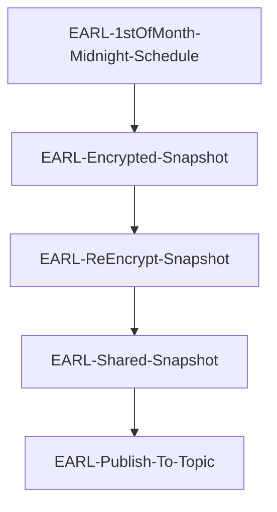
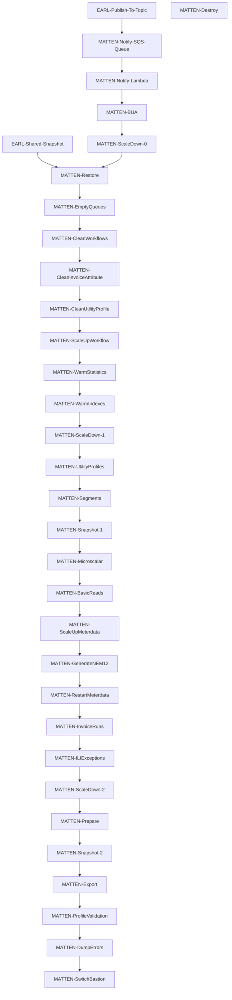

# Bottom Up Accruals AWS Serverless Project

Accrued Revenue report required for finance, 
how many units has a customer consumed in a month or over a periods selected that we have not billed for 
(this should consider where a customer is not yet due to be billed).

https://jira.alintaenergy.com.au/browse/CB-6866

## Service Dependencies

The BUA process relies upon the version of workflow and meterdata matching what was in EARL when the snapshot was taken.

```Each month after the CORE release it is important to update the service version in matten```

```When updating the service version in matten it is important to update any variables that have changed as well```

```The project makefile target check-workflow-config-matten will check for workflow config differences between earl and matten```

```The project makefile target check-meterdata-config-matten will check for meterdata config differences between earl and matten```

```Note that most differences are acceptable since the config in matten is meant to be different to earl to support higher performance```

### ANSTEAD

| Accrual         | Snapshot                                                                    | Snapshot Date | Workflow | Meterdata | Anstead | Notes                                           |
|-----------------|-----------------------------------------------------------------------------|---------------|----------|-----------|---------|-------------------------------------------------|
| September 2023  | prod-data-2023-10-01-snapshot-shared-key                                    | 1st Oct 2023  | v25427   | v27560    | #24     | workflow with improved retry sequence key logic |
| October 2023    | prd-earl-1-sql-21-20-oct-31-2023-shared-key-encrypted                       | 1st Nov 2023  | v25427   | v27598    |         |
| November 2023   | prd-earl-1-sql-13-00-nov-30-2023-shared-key-encrypted                       | 1st Dec 2023  | v25427   | v27649    | #26     |
| December 2023   | prd-earl-1-sql-13-00-dec-31-2023-shared-key-encrypted                       | 1st Jan 2024  | v25427   | v27718    | #27     |
| December 2023   | tmp-prd-earl-1-sql-23-15-Jan-21-2024-11-24-Jan-22-2024-shared-key-encrypted | 21st Jan 2024 | v25433   | v27843    | #29     | disable keepalive in workflow                   |
| December 2023   | tst-anstead-29-bua-sql-20240101-20240123-20240125-095423                    | 21st Jan 2024 | v25427   | v27843    | #30     | testing rds oom during invoicing                |

### MATTEN

| Accrual         | Snapshot                                                                    | Snapshot Date | Workflow | Meterdata | Matten   | Runtime  |
|-----------------|-----------------------------------------------------------------------------|---------------|----------|-----------|----------|----------|
| September 2023  | prod-data-2023-10-01-snapshot-shared-key                                    | 1st Oct 2023  | v25427   | v27560    | #19      |
| October 2023    | prd-earl-1-sql-21-20-oct-31-2023-shared-key-encrypted                       | 1st Nov 2023  | v25427   | v27598    | #13, #20 |
| November 2023   | prd-earl-1-sql-13-00-nov-30-2023-shared-key-encrypted                       | 1st Dec 2023  | v25427   | v27649    | #16      |
| December 2023   | prd-earl-1-sql-13-00-dec-31-2023-shared-key-encrypted                       | 1st Jan 2024  | v25427   | v27718    | #18      | 21:45:11 |
| January 2024    | prd-earl-1-sql-13-00-jan-31-2024-shared-key-encrypted                       | 1st Feb 2024  | v25427   | v27843    | #21      | 21:46:22 |

## Monthly pre-run checks (after the CORE release each month)

#### Update version of services in ANSTEAD and MATTEN

1. Get the latest version of workflow and meterdata from EARL
2. Update the cluster project for matten and anstead with the same versions
3. Update the configuration in the matten EKS cluster with the same versions manually
4. Update the configuration in the anstead EKS cluster with the same versions manually

#### Update service configuration changes from EARL into ANSTEAD and MATTEN

1. Run the makefile target check-workflow-config-matten to check for new config for workflow
2. Update the cluster project for matten and anstead with any new config needed for workflow
3. Update the configuration in matten EKS cluster with any new config needed for workflow
4. Update the configuration in anstead EKS cluster with any new config needed for workflow
5. Run the makefile target check-meterdata-config-matten to check for new config for meterdata
6. Update the cluster project for matten and anstead with any new config needed for meterdata
7. Update the configuration in matten EKS cluster with any new config needed for meterdata 
8. Update the configuration in anstead EKS cluster with any new config needed for meterdata 

#### Validate EKS configuration in ANSTEAD and MATTEN

1. Execute the gitlab task anstead:90:check:eks to verify that the cluster works with the updated configuration
2. Execute the gitlab task matten:90:check:eks to verify that the cluster works with the updated configuration

#### Get latest EARL snapshot and test in ANSTEAD

```
Alinta platforms gitlab project to generate EARL snapshots for ANSTEAD
https://gitlab.com/alintaenergy/ops/utils/month-end-prod-data-workflow/-/pipelines
```

1. Execute the task anstead-rds-refresh in the ops/utils/month-end-prod-data-workflow gitlab project pipeline
2. Check the tst-anstead-bua step function has executed successfully in ANSTEAD once the above gitlab task has completed
3. Execute the anstead:99:rerun gitlab task in the bua-aws gitlab project to test the snapshot in ANSTEAD
4. Check the tst-anstead-bua step function has re-run succesfully.

#### Check the EARL monthly schedule
1. Check the EventBridge rule in EARL Prod-monthly-data-copy-Workflo-ScheduleRuleDA5BD877-mQj81xNFV30u will run at the right time (in local time zone)


## Manually executing the run

If the last run needs to be repeated in a new RDS instance then use the gitlab task ```rerun``` to achieve this.

If particular steps need to be run with the current RDS instance then use the relevant gitlab task.

## Deleting the RDS instance

The best way to delete an RDS instance from a prior run is to delete the cloudformation stack that created it.

For example: 
```aws cloudformation delete-stack --stack-name prd-matten-16-bua-sql``` 


## Execution and Monitoring

### BEWARE, WARNING

**IT IS NOT A GOOD IDEA TO RUN THE PROFILING STEP FUNCTION TWICE FOR THE SAME RUN DATE**

The reason is it takes a while to delete the old records and the lambda often times out trying.
If you need to then manually delete the old records first and then run it.

**IT IS IMPORTANT THAT THE SAME RUN DATE IS USED FOR ALL STEP FUNCTIONS**

If you do not then chances are the correct data will not be found by subsequent step functions.
If you need to re-run steps after an automated run fails, 
then ensure you use the same run date for the manual steps as was used for the automated run.

**DO NOT RUN TESTS IN ANSTEAD ON THE 1st OF THE MONTH**

On the first of the month a snapshot of EARL is provided to MATTEN and automatically triggers the monthly run.
The same snapshot is then anonymised in EARL and then provided to ANSTEAD where it triggers updating the parameter store ready for use.
The anonymisation takes about 15 hours, so this occurs around 3-4pm on the 1st of the month in ANSTEAD.
Therefore, do not run the step functions on the 1st of the month in ANSTEAD to avoid conflicts with this automated process.


## Architecture

### EARL Pipeline



### MATTEN Pipeline



## Stored Procedures

| Stored Procedure           | Purpose                                                                            |
|----------------------------|------------------------------------------------------------------------------------|
| bua_create_basic_read      | Create missing basic read records for an account                                   |
| bua_create_invoice_scalar  | Create invoice scalar records for an account                                       |
| bua_create_macro_profile   | Create macro scalar records for an account                                         |
| bua_dates_to_check         | List the dates to check for the period being calculated                            |
| bua_mark_segment_jurisdiction_entries | Mark invalid segment jurisdiction entries                                          |
| bua_fill_marked_segment_jurisdiction_entries | Fill marked interval profiles with equivalent records                              |
| import_gas_volumes_profile_creation | Create gas profiles                                                                |
| bua_initiate               | Initiate calculations from SQL using workflow (not used)                           |
| bua_initiate_invoice_runs  | Initiate all invoice runs                                                          |
| bua_list_profile_registers | Get a list of all registers that are used for profile generation                   |
| bua_list_profile_nmis      | Get a list of all NMIs that require NEM12 file generation                          |
| bua_list_unbilled_accounts | Get a list of accounts that are unbilled for some period                           |
| bua_list_all_accounts      | Get a list of all accounts open at some time during the period                     |
| bua_list_missing_periods   | List the missing periods                                                           |
| bua_prepare_export_data    | Populate export tables with data for an account                                    |
| core_warm_database_statistics | Trigger the execution of statistics on each table and partition (uses workflow) |
| core_warm_database_indexes    | Trigger the execution of index warming for each index (uses workflow)           |
| core_warm_table               | Analyse a table                                                                    |
| core_warm_partition           | Analyze a partition                                                                |
| core_warm_index               | Warm an index                                                                      |

## Lambda functions

| Function                   | Purpose                                                                          |
|----------------------------|----------------------------------------------------------------------------------|
| lambda-bua-controller-fast | Controls execution of the BUA process (3 minute timeout)                         |
| lambda-bua-controller-slow | Controls execution of the BUA process (15 minute timeout)                        |
| lambda-bua-next            | Controls next step in SQS processing control                                     |
| lambda-bua-notify          | Trigger the BUA step function based on a notification from a topic               |
| lambda-bua-site-basic      | Low concurrency SQS driven missing basic reads execution (32 concurrent)         |
| lambda-bua-site-data       | High concurrency SQS driven utility profile processing (800 concurrent)          |
| lambda-bua-site-export     | Low concurrency SQS driven export of BUA data (32 concurrent)                    |
| lambda-bua-site-initiate   | SQS driven site data processing initiation                                       |
| lambda-bua-site-mscalar    | Low concurrency SQS driven microscalar execution (32 concurrent)                 |
| lambda-bua-site-nem12      | Low concurrency SQS driven NEM12 generation (32 concurrent)                      |
| lambda-bua-site-prepare    | Low concurrency SQS driven prepare export data (32 concurrent)                   |
| lambda-bua-site-segment    | Low concurrency SQS driven interval profile segment calculations (32 concurrent) |

## State Machines

| State machine              | Purpose                                                    | Step Name             |
|----------------------------|------------------------------------------------------------|-----------------------|
| bua                        | Controller machine                                         | DoNothing             |
| bua-basicreads             | Calculate missing basic reads                              | BasicReads            |
| bua-clean-invoiceattribute | Clean the invoiceattribute table                           | CleanInvoiceAttribute |
| bua-clean-utilityprofile   | Clean the utilityprofile table                             | CleanUtilityProfile   |
| bua-clean-workflows        | Clean the workflowinstance table                           | CleanWorkflows        |
| bua-destroy                | Destroy the BUA RDS instance                               | Destroy               |
| bua-dump-errors            | Dump messages in failure and dlq SQS queues to S3          | DumpErrors            |
| bua-empty-queues           | Purge failure and dlqs from SQS                            | EmptyQueues           |
| bua-export                 | Export BUA data to S3                                      | Export                |
| bua-ili-exceptions         | Run ili exceptions filters                                 | ILIExceptions         |
| bua-invoiceruns            | Execute all invoice runs                                   | InvoiceRuns           |
| bua-microscalar            | Calculate microscalar values                               | Microscalar           |
| bua-nem12                  | Generate missing NEM12 files                               | GenerateNEM12         |
| bua-prepare                | Prepare data for export to S3                              | Prepare               |
| bua-profile-validation     | Perform utility profile validation                         | ProfileValidation     |
| bua-reset-basicreads       | Reset any previously generated basic reads                 | ResetBasicReads       |
| bua-reset-nem12            | Reset generated NEM12 files                                | ResetNEM12            |
| bua-restart-meterdata      | Restart the workflow and meterdata pods                    | RestartMeterdata      |
| bua-restore                | Restore a RDS snapshot                                     | Restore               |
| bua-scaledown              | Scale down nodegroup and replicas                          | ScaleDown             |
| bua-scaleup-meterdata      | Scale up nodegroup and replicas for workflow and meterdata | ScaleUpMeterdata      |
| bua-scaleup-workflow       | Scale up nodegroup and replicas for workflow to execute    | ScaleUpWorkflow       |
| bua-segments               | Calculate profile segments                                 | Segments              |
| bua-snapshot               | Take a snapshot of the RDS instance                        | Snapshot              |
| bua-switch-bastion         | Switch the Route53 entry for the bastion RDS port          | SwitchBastion         |
| bua-utility-profiles       | Extract DDB data and calculate utility profiles            | UtilityProfiles       |
| bua-warm-indexes           | Warm the indexes of specific tables                        | WarmIndexes           | 
| bua-warm-statistics         | Warm the statistics of all tables                         | WarmStatistics        |
| bua-warming                | Force read from S3 to EBS for an RDS instance              | Warming               |

## Step Functions

### bua-restore

*bua-restore* is used to create an RDS instance from a production snapshot.

#### Prerequisites

None

#### Dependencies

| Type      | Name              |
|-----------|-------------------|
| Parameter | cluster_name      |
| Parameter | domain            |
| Parameter | hosted_zone_id    |
| Parameter | instance_class    |
| Parameter | instance_type     |
| Parameter | mysql_version     |
| Parameter | node_group_name   |
| Parameter | params_id         |
| Parameter | rds_dns_alias     |
| Parameter | rdssecret         |
| Parameter | schema            |
| Parameter | snapshot_arn      |
| Parameter | source_account_id |
| Parameter | sqlsecret         |
| Parameter | suffix            |
| Parameter | update_id         |

#### Steps

1. Copy snapshot from EARL to MATTEN to use for restoring a new RDS instance.
2. Execute Cloudformation template to create an RDS instance from a snapshot.
2. Reset the core_admin password of the new RDS instance.
3. Disable all workflow schedules
4. Set user passwords (for workflow, meterdata, and lambda)
6. Calculate statistics for AggregatedRead
7. Scale down any workflow or meterdata pods
8. Set the Route53 entry to point to the new RDS instance
9. Set the bua account id GlobalSetting value to this account


### bua-scaleup-workflow

*bua-scaleup-workflow* is used to scale the EKS cluster to 1 node and workflow pods to 1 replicas.

#### Prerequisites

None

#### Dependencies

| Type      | Name              |
|-----------|-------------------|
| Parameter | cluster_name      |

#### Steps

1. scale EKS node group to 1 nodes
2. scale workflow to 1 replicas


### bua-warm-statistics

*bua-warm-statistics* is used to drag in as many blocks from S3 to EBS as possible on the newly created database.

#### Prerequisites

| Step        |
|-------------|
| bua-restore |

#### Dependencies

| Type      | Name                            |
|-----------|---------------------------------|
| Service   | workflow-runner                 |
| Procedure | core_warm_database_statistics   |

#### Steps

1. execute core_warm_database_statistics
2. wait for workflows to complete


### bua-warm-indexes

*bua-warm-indexes* is used to drag in as many blocks from S3 to EBS as possible on the newly created database.

#### Prerequisites

| Step                |
|---------------------|
| bua-warm-statistics |

#### Dependencies

| Type    | Name            |
|---------|-----------------|
| Service | workflow-runner |

#### Steps

3. create EventLog records to warm indexes for select tables
4. wait for workflows to complete


### bua-utility-profiles

*bua-utility-profiles* is used to extract the data from ddb and calculate utility profiles for interval electricity sites.

#### Prerequisites

| Step                |
|---------------------|
| bua-warm-statistics |
| bua-warm-indexes    |

#### Dependencies

| Type      | Name                       |
|-----------|----------------------------|
| Procedure | bua_list_profile_registers |

#### Steps

1. Warm the MeterRegister table
2. Warm the MarketPayloadMapping table
3. Warm the Meter table
4. Warm the Utility table
5. Warm the UtilityDetail table
6. Warm the UtilityNetwork table
7. Warm the UtilityTni table
8. Warm the Jurisdiction table
9. Warm the ServiceType table
10. Warm the MeterRegister table
11. Clean the UtilityProfile table
12. initiate extract interval reads from DDB to UtilityProfile
13. Call bua_list_profile_registers
13. wait for SQS queues to empty

#### Logging

BUAControl table records progress of the controller

UtilityProfileLog table records progress of the utility profile processing


### bua-segments

*bua-segments* is used to calculate the segment profiles for interval electricity sites.

#### Prerequisites

| Step                 |
|----------------------|
| bua-utility-profiles |

#### Dependencies

| Type      | Name                                         |
|-----------|----------------------------------------------|
| Procedure | bua_dates_to_check                           |
| Procedure | bua_mark_segment_jurisdiction_entries        |
| Procedure | bua_fill_marked_segment_jurisdiction_entries |
| Procedure | bua_create_macro_profile                     |

#### Steps

1. initiate calculation of SegmentJurisdictionAvgExclEst
2. wait for SQS queues to empty
3. initiate SegmentJurisdictionCheck to find invalid segments
4. wait for SQS queues to empty
5. initiate SegmentJurisdictionFix to fix invalid segments
6. wait for SQS queues to empty
9. execute bua_create_macro_profile

#### Logging

BUAControl table records progress of the controller

UtilityProfileLog table records progress of the utility profile processing


### bua-microscalar

*bua-microscalar* is used to calculate the microscalars for each account.

#### Prerequisites

| Step         |
|--------------|
| bua-segments |

#### Dependencies

| Type      | Name                        |
|-----------|-----------------------------|
| Procedure | bua_prep_unbilled_accounts  |
| Procedure | bua_create_invoice_scalar   |

#### Steps

1. initiate MicroScalar to calculate micro scalar records
2. wait for SQS queues to empty


### bua-reset-basicreads

*bua-reset-basicreads* is used to clear out any generated basic reads.

#### Prerequisites

None

#### Dependencies

| Type      | Name                       |
|-----------|----------------------------|
| Procedure | bua_prep_unbilled_accounts |
| Procedure | bua_reset_basic_read       |

#### Steps

1. initiate ResetBasicRead to reset any prior calculated basic reads
2. wait for SQS queues to empty
3. check BUAControl table for any failures


### bua-basicreads

*bua-basicreads* is used to generate any missing basic reads.

#### Prerequisites

| Step            |
|-----------------|
| bua-microscalar |

#### Dependencies

| Type      | Name                       |
|-----------|----------------------------|
| Procedure | bua_prep_unbilled_accounts |
| Procedure | bua_create_basic_read      |

#### Steps

1. initiate BasicRead to create missing basic reads
2. wait for SQS queues to empty
3. check BUAControl table for any failures


### bua-scaleup-meterdata

*bua-scaleup-meterdata* is used to scale EKS to 10 nodes and meterdata to 8 replicas.

#### Prerequisites

None

#### Dependencies

| Type      | Name              |
|-----------|-------------------|
| Parameter | cluster_name      |

#### Steps

1. scale EKS node group to 10 nodes
2. scale workflow to 1 replicas
2. scale meterdata to 8 replicas


### bua-nem12

*bua-nem12* is used to generate and load missing electricity interval reads.

#### Summary

1. Use the bua_initiate action to get a list of NMI and date ranges to process
2. For each NMI and date range submit a message to a queue.
3. Use a cluster of 32 nem12 lambdas to consume the messages on the queue.
4. For each message query the database for missing periods in AggregatedRead. 
5. Construct a NEM12 file for the missing periods and submit it to the standard NEM12 file processing S3 bucket.
6. Standard NEM12 file processing loads the NEM12 file into DDB and triggers import and aggregation in CORE using workflow.

#### Prerequisites

| Step           |
|----------------|
| bua-segments   |

#### Dependencies

| Type      | Name                  |
|-----------|-----------------------|
| Procedure | bua_prep_profile_nmis |
| Service   | workflow-runner       |
| Service   | meterdata             |

#### Steps

1. initiate NEM12 generation for missing electricity interval reads
2. wait for SQS queues to empty
3. wait for workflow instances to complete
4. reschedule any failed workflow instances
5. wait for rescheduled workflow instances to complete
6. check for any remaining failed workflow instances


### bua-invoiceruns

*bua-invoiceruns* is used to execute invoicing for all accounts.

#### Prerequisites

| Step            |
|-----------------|
| bua-segments    |
| bua-microscalar |
| bua-basicreads  |

#### Dependencies

| Type      | Name                      |
|-----------|---------------------------|
| Procedure | bua_initiate_invoice_runs |
| Service   | workflow-runner           |
| Service   | meterdata                 |

#### Steps

1. set priorities of workflows appropriately
2. initiate invoice run batches
3. wait for all workflow schedules to execute
4. wait for GENERATE_ILI to complete
5. wait for RUN_INVOICE_BATCH to complete
6. resubmit failed RUN_INVOICE_BATCH
7. wait for resubmitted RUN_INVOICE_BATCH to complete
8. check for any remaining failed RUN_INVOICE_BATCH
9. wait for INVOICEGEN to complete
10. resubmit failed INVOICEGEN
11. wait for resubmitted INVOICEGEN to complete
12. check for any remaining failed INVOICEGEN


### bua-scaledown

*bua-scaledown* is used to scale meterdata and workflow to 0 replicas and EKS to 0 nodes.

#### Prerequisites

None

#### Dependencies

| Type      | Name              |
|-----------|-------------------|
| Parameter | cluster_name      |

#### Steps

1. scale EKS node group to 0 nodes
2. scale workflow and meterdata to 0 replicas


### bua-prepare

*bua-prepare* is used to prepare the BUA data for export to S3.

#### Prerequisites

| Step             |
|------------------|
| bua-invoiceruns  |

#### Dependencies

| Type      | Name                    |
|-----------|-------------------------|
| Procedure | bua_prep_all_accounts   |
| Procedure | bua_prepare_export_data |

#### Steps

1. Truncate BUAAccountSummary and InvoiceLineItemMonthly
2. Remove any old S3 files from prd-matten-s3-bua/export/csv/{{run_date}}/
3. Initiate preparation of data to export
4. Wait for SQS queues to empty


### bua-export

*bua-export* is used to export the BUA data to S3.

#### Prerequisites

| Step        |
|-------------|
| bua-prepare |

#### Dependencies

None

#### Steps

1. Export BUAAccountSummary as CSV to prd-matten-s3-bua/export/csv/{{run_date}}/
2. Export InvoiceLineItemMonthly as CSV to prd-matten-s3-bua/export/csv/{{run_date}}/
3. Wait for SQS queues to empty
4. Copy S3 objects from prd-matten-s3-bua/export/csv/{{run_date}}/ to prd-matten-s3-rw-integration/ADH/OUTBOUND/BUA/


### bua-destroy

*bua-destroy* is used to destroy the BUA RDS instance.

#### Prerequisites

None

#### Dependencies

None

#### Steps

1. Delete the cloudformation stack (e.g. prd-matten-14-bua-sql)
