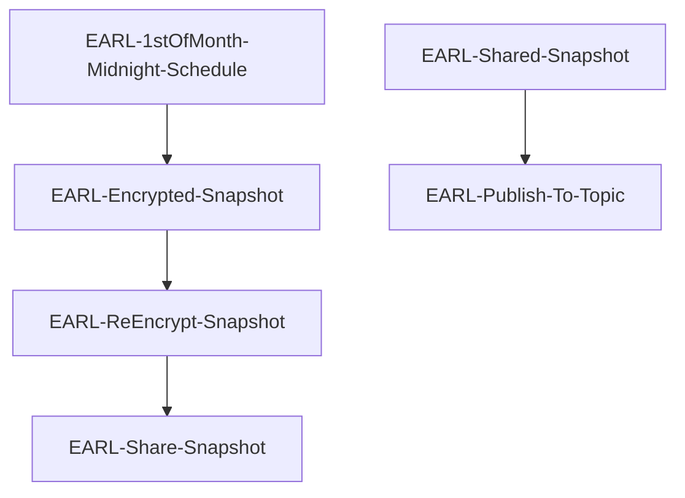
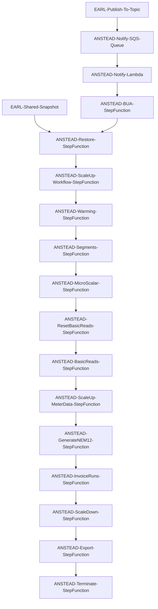

# Bottom Up Accruals AWS Serverless Project

Accrued Revenue report required for finance, 
how many units has a customer consumed in a month or over a periods selected that we have not billed for 
(this should consider where a customer is not yet due to be billed).

https://jira.alintaenergy.com.au/browse/CB-6866

## Architecture

### EARL Pipeline

### ANSTEAD Pipeline

## Stored Procedures

| Stored Procedure           | Purpose                                                                            |
|----------------------------|------------------------------------------------------------------------------------|
| bua_create_basic_read      | Create missing basic read records for an account                                   |
| bua_create_invoice_scalar  | Create invoice scalar records for an account                                       |
| bua_create_macro_profile   | Create macro scalar records for an account                                         |
| bua_dates_to_check         | List the dates to check for the period being calculated                            |
| bua_mark_segment_jurisdiction_entries | Mark invalid segment jurisdiction entries                                          |
| bua_fill_marked_segment_jurisdiction_entries | Fill marked interval profiles with equivalent records                              |
| import_gas_volumes_profile_creation | Create gas profiles                                                                |
| bua_initiate               | Initiate calculations from SQL using workflow (not used)                           |
| bua_initiate_invoice_runs  | Initiate all invoice runs                                                          |
| bua_list_profile_registers | Get a list of all registers that are used for profile generation                   |
| bua_list_profile_nmis      | Get a list of all NMIs that require NEM12 file generation                          |
| bua_list_unbilled_accounts | Get a list of accounts that are unbilled for some period                           |
| bua_list_all_accounts      | Get a list of all accounts open at some time during the period                     |
| bua_list_missing_periods   | List the missing periods                                                           |
| bua_prepare_export_data    | Populate export tables with data for an account                                    |
| core_warm_database_statistics | Trigger the execution of statistics on each table and partition (uses workflow) |
| core_warm_database_indexes    | Trigger the execution of index warming for each index (uses workflow)           |
| core_warm_table               | Analyse a table                                                                    |
| core_warm_partition           | Analyze a partition                                                                |
| core_warm_index               | Warm an index                                                                      |

## Lambda functions

| Function                   | Purpose                                                                          |
|----------------------------|----------------------------------------------------------------------------------|
| lambda-bua-controller-fast | Controls execution of the BUA process (3 minute timeout)                         |
| lambda-bua-controller-slow | Controls execution of the BUA process (15 minute timeout)                        |
| lambda-bua-next            | Controls next step in SQS processing control                                     |
| lambda-bua-notify          | Trigger the BUA step function based on a notification from a topic               |
| lambda-bua-site-basic | Low concurrency SQS driven missing basic reads execution (32 concurrent)         |
| lambda-bua-site-data | High concurrency SQS driven site data processing (800 concurrent)                |
| lambda-bua-site-export | Low concurrency SQS driven export of BUA data (32 concurrent)                    |
| lambda-bua-site-initiate | SQS driven site data processing initiation                                       |
| lambda-bua-site-mscalar | Low concurrency SQS driven microscalar execution (32 concurrent)                 |
| lambda-bua-site-nem12 | Low concurrency SQS driven NEM12 generation (32 concurrent)                      |
| lambda-bua-site-prepare | Low concurrency SQS driven prepare export data (32 concurrent)                   |
| lambda-bua-site-segment | Low concurrency SQS driven interval profile segment calculations (32 concurrent) |

## State Machines

| State machine | Purpose |
|---------------|---------|
| bua           | Controller machine |
| bua-restore | Restore a RDS snapshot |
| bua-scaleup-workflow | Scale up nodegroup and replicas for workflow to execute |
| bua-warming | Force read from S3 to EBS for an RDS instance |
| bua-segments | Calculate profile segments |
| bua-microscalar | Calculate microscalar values |
| bua-reset-basicreads | Reset any previously generated basic reads |
| bua-basicreads | Calculate missing basic reads |
| bua-scaleup-meterdata | Scale up nodegroup and replicas for meterdata to execute |
| bua-nem12 | Generate missing NEM12 files |
| bua-invoiceruns | Execute all invoice runs |
| bua-scaledown | Scale down nodegroup and replicas |
| bua-export | Export BUA data to S3 |
| bua-terminate | Terminate the BUA RDS instance |

## Execution and Monitoring

### BEWARE, WARNING

**IT IS NOT A GOOD IDEA TO RUN THE PROFILING STEP FUNCTION TWICE FOR THE SAME RUN DATE**

The reason is it takes a while to delete the old records and the lambda often times out trying.
If you need to then manually delete the old records first and then run it.

**IT IS IMPORTANT THAT THE SAME RUN DATE IS USED FOR ALL STEP FUNCTIONS**

If you do not then chances are the correct data will not be found by subsequent step functions.
If you need to re-run steps after an automated run fails, 
then ensure you use the same run date for the manual steps as was used for the automated run.

### bua-restore

*bua-restore* is used to create an RDS instance from a production snapshot.

| Resource | Value | Purpose |
|----------|-------|---------|
| Step Function | tst-anstead-bua | Controller Step Function |
| Step Function | tst-anstead-restore | Restore Step Function |
| DynamoDB Table | tst-anstead-ddb-bua | Control table |
| DynamoDB Partition Key | BUA Restore | Key to identify control records |
| Cloudformation Stack | tst-anstead-14-bua-sql | Stack to create RDS instance |

1. Execute Cloudformation template to create an RDS instance from a snapshot.
2. Reset the core_admin password of the new RDS instance.
3. Disable all workflow schedules
4. Truncate WorkflowInstance and EventLog tables
5. Set user passwords (for workflow, meterdata, and lambda)
6. Calculate statistics for AggregatedRead
7. Scale down any workflow or meterdata pods
8. Set the Route53 entry to point to the new RDS instance

### bua-scaleup-workflow

*bua-scaleup-workflow* is used to scale the EKS cluster to 1 node and workflow pods to 1 replicas.

1. scale EKS node group to 1 nodes
2. scale workflow to 1 replicas

### bua-warming

*bua-warming* is used to drag in as many blocks from S3 to EBS as possible on the newly created database.

1. execute core_warm_database_statistics
2. wait for workflows to complete
3. execute core_warm_database_indexes
4. wait for workflows to complete

### bua-segments

*bua-segments* is used to calculate the segment profiles for interval electricity sites.

1. initiate extract interval reads from DDB to UtilityProfile
2. wait for SQS queues to empty
2. initiate calculation of SegmentJurisdictionAvgExclEst
3. wait for SQS queues to empty
4. initiate SegmentJurisdictionCheck to find invalid segments
5. wait for SQS queues to empty
6. initiate SegmentJurisdictionFix to fix invalid segments
7. wait for SQS queues to empty
8. initiate Validate to validate segments for anomalies
9. wait for SQS queues to empty
10. execute bua_create_macro_profile

### bua-microscalar

*bua-microscalar* is used to calculate the microscalars for each account.

1. initiate MicroScalar to calculate micro scalar records
2. wait for SQS queues to empty

### bua-reset-basicreads

*bua-reset-basicreads* is used to clear out any generated basic reads.

1. initiate ResetBasicRead to reset any prior calculated basic reads
2. wait for SQS queues to empty
3. check BUAControl table for any failures

### bua-basicreads

*bua-basicreads* is used to generate any missing basic reads.

1. initiate BasicRead to create missing basic reads
2. wait for SQS queues to empty
3. check BUAControl table for any failures

### bua-scaleup-meterdata

*bua-scaleup-meterdata* is used to scale EKS to 10 nodes and meterdata to 8 replicas.

1. scale EKS node group to 10 nodes
2. scale meterdata to 8 replicas

### bua-nem12

*bua-nem12* is used to generate and load missing electricity interval reads.

1. initiate NEM12 generation for missing electricity interval reads
2. wait for SQS queues to empty
3. wait for workflow instances to complete
4. reschedule any failed workflow instances
5. wait for rescheduled workflow instances to complete
6. check for any remaining failed workflow instances

### bua-invoiceruns

*bua-invoiceruns* is used to execute invoicing for all accounts.

1. set priorities of workflows appropriately
2. initiate invoice run batches
3. wait for all workflow schedules to execute
4. wait for GENERATE_ILI to complete
5. wait for RUN_INVOICE_BATCH to complete
6. resubmit failed RUN_INVOICE_BATCH
7. wait for resubmitted RUN_INVOICE_BATCH to complete
8. check for any remaining failed RUN_INVOICE_BATCH
9. wait for INVOICEGEN to complete
10. resubmit failed INVOICEGEN
11. wait for resubmitted INVOICEGEN to complete
12. check for any remaining failed INVOICEGEN

### bua-scaledown

*bua-scaledown* is used to scale meterdata and workflow to 0 replicas and EKS to 0 nodes.

1. scale EKS node group to 0 nodes
2. scale workflow and meterdata to 0 replicas

### bua-export

*bua-export* is used to prepare and export the BUA data to S3.

1. Truncate BUAAccountSummary and InvoiceLineItemMonthly
2. Remove any old S3 files from tst-anstead-s3-bua/export/csv/{{run_date}}/
3. Remove any old S3 files from tst-anstead-s3-rw-integration/ADH/OUTBOUND/BUA/
4. Initiate preparation of data to export
5. Wait for SQS queues to empty
6. Export BUAAccountSummary as CSV to tst-anstead-s3-bua/export/csv/{{run_date}}/
7. Export InvoiceLineItemMonthly as CSV to tst-anstead-s3-bua/export/csv/{{run_date}}/
8. Wait for SQS queues to empty
9. Copy S3 objects from tst-anstead-s3-bua/export/csv/{{run_date}}/ to tst-anstead-s3-rw-integration/ADH/OUTBOUND/BUA/

### bua-terminate

*bua-terminate* is used to terminate the BUA RDS instance.

1. Delete the cloudformation stack tst-anstead-14-bua-sql
