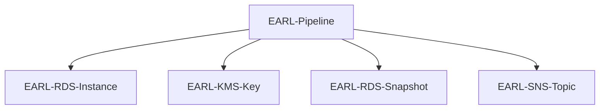
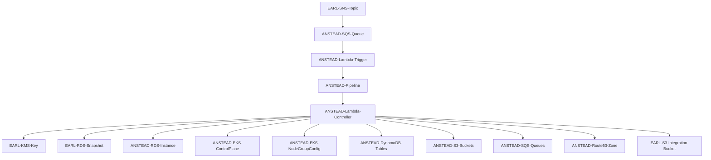

# Bottom Up Accruals AWS Serverless Project

Accrued Revenue report required for finance, 
how many units has a customer consumed in a month or over a periods selected that we have not billed for 
(this should consider where a customer is not yet due to be billed).

https://jira.alintaenergy.com.au/browse/CB-6866

## Architecture

### EARL Pipeline

### ANSTEAD Pipeline

## Stored Procedures

| Stored Procedure           | Purpose                                                          |
|----------------------------|------------------------------------------------------------------|
| bua_list_profile_registers | Get a list of all registers that are used for profile generation |
| bua_list_profile_nmis      | Get a list of all NMIs that require NEM12 file generation        |
| bua_list_unbilled_accounts | Get a list of accounts that are unbilled for some period         |
| bua_list_all_accounts      | Get a list of all accounts open at some time during the period   |

## Lambda functions

| Function                   | Purpose                                                           |
|----------------------------|-------------------------------------------------------------------|
| lambda-bua-controller-fast | Controls execution of the BUA process (3 minute timeout)          |
| lambda-bua-controller-slow | Controls execution of the BUA process (15 minute timeout)         |
| lambda-bua-next            | Controls next step in SQS processing control                      |
| lambda-bua-site-data | High concurrency SQS driven site data processing (800 concurrent) |
| lambda-bua-site-initiate | SQS driven site data processing initiation                        |
| lambda-bua-site-segment | Low concurrency SQS driven site data processing (32 concurrent)   |

## State Machines

| State machine | Purpose |
|---------------|---------|
| bua           | Controller machine |
| bua-restore | Restore a RDS snapshot |
| bua-scaleup-workflow | Scale up nodegroup and replicas for workflow to execute |
| bua-warming | Force read from S3 to EBS for an RDS instance |
| bua-segments | Calculate profile segments |
| bua-microscalar | Calculate microscalar values |
| bua-scaleup-meterdata | Scale up nodegroup and replicas for meterdata to execute |
| bua-nem12 | Generate missing NEM12 files |
| bua-reset-basicreads | Reset any previously generated basic reads |
| bua-basicreads | Calculate missing basic reads |
| bua-invoiceruns | Execute all invoice runs |
| bua-scaledown | Scale down nodegroup and replicas |

## Issues

| Issue                                                                                                                             |
|-----------------------------------------------------------------------------------------------------------------------------------|
| Runtime.ImportModuleError:                                                                                                        |
| Unable to import module 'index': cannot import name 'DEFAULT_CIPHERS' from 'urllib3.util.ssl_' (/opt/python/urllib3/util/ssl_.py) |
| https://stackoverflow.com/questions/76414514/cannot-import-name-default-ciphers-from-urllib3-util-ssl-on-aws-lambda-us            |
| Resolution: pin boto3 to 1.28.54 and botocore to 1.31.54                                                                          |
